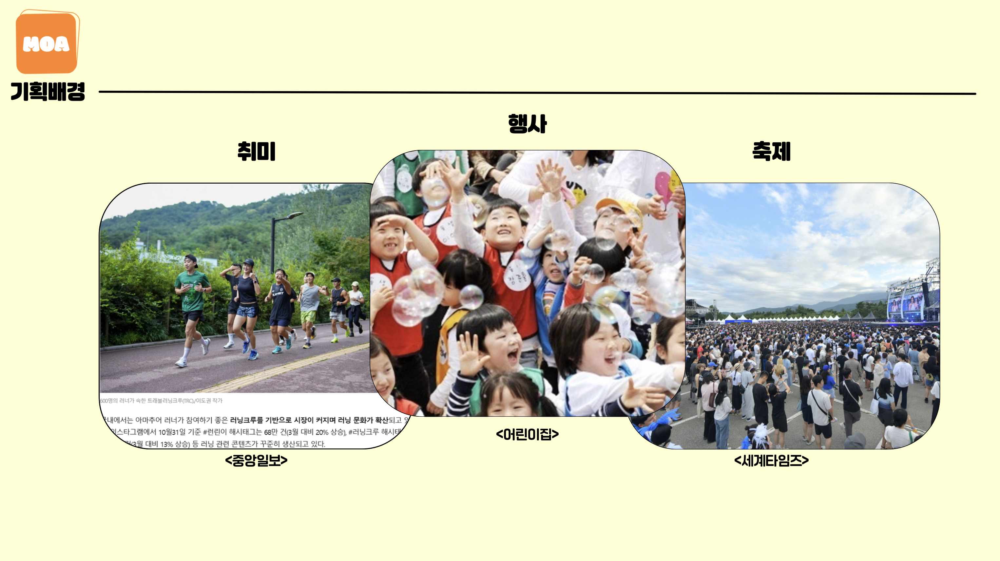
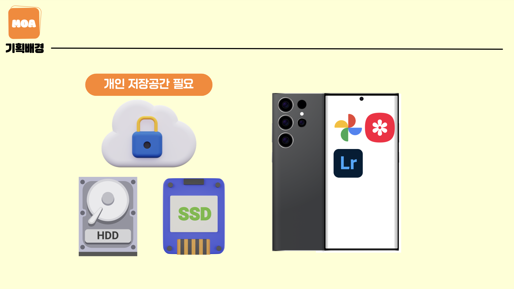
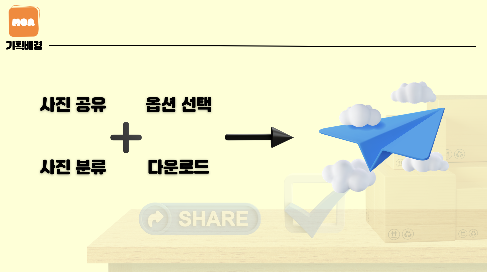
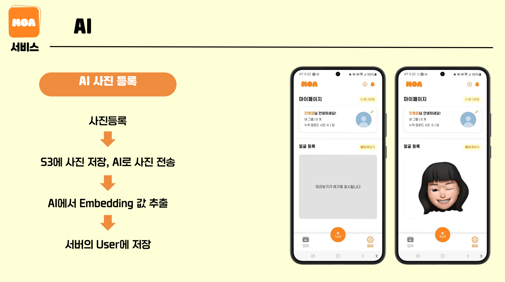
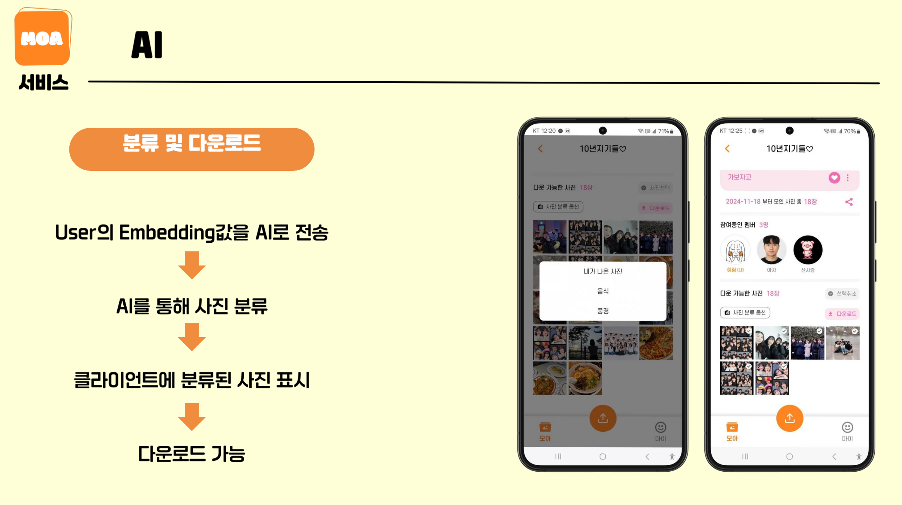
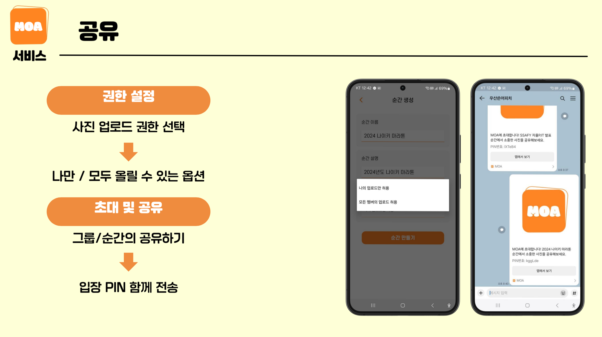
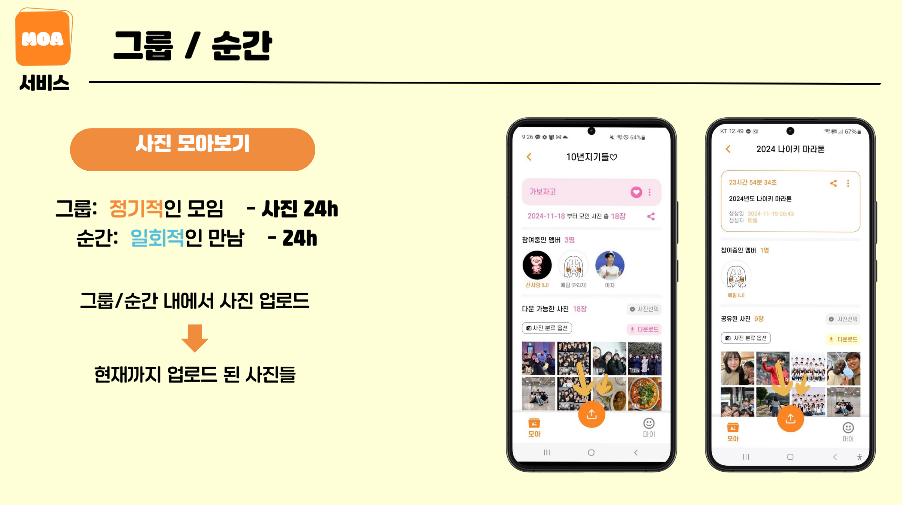
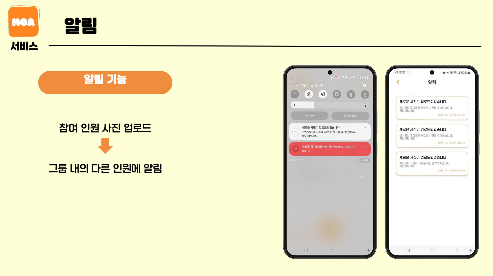
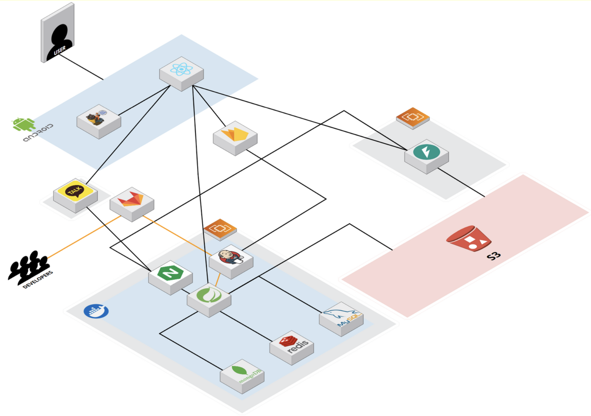
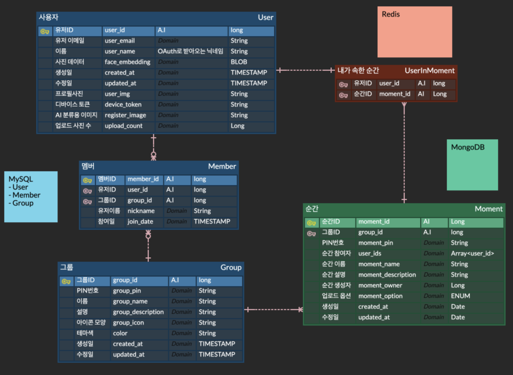

# 모아 (MoA : Moment of Affection)

# 모아
> **삼성 청년 SW 아카데미 팀 프로젝트**   **개발기간: 2024.10.14 ~ 2024.11.19**
## 기획배경
> 놀러가거나, 사람들이랑 사진을 주고 받을 때, 내가 나온 사진만 찾기 귀찮지 않으셨나요?

> 핸드폰에 있는 사진분류 기능, 다 다운받은 다음에 나눠야하는데 휴대폰 저장공간 없으시죠?

## 개발팀 소개

## 프로젝트 소개
- 프로젝트명: 모아
- 서비스 특징: 클라우드 내 임시 그룹 사진 공유 서비스 및 AI 기반 사진 분류 서비스
- 주요 기능
    - 개인 클라우드나 로컬 스토리지가 아닌, 공유 클라우드에서 사진 공유
    - 불특정 다수의 일회성 모임을 위해 일정 시간만 유지되는 순간
    - 정기적인 모임을 위한 그룹 기능
    - AI 기반의 내 사진, 음식, 풍경 사진 분류

## 주요 역할

- 
- 

## 프로젝트 성과

- **삼성 청년 SW 아카데미 모바일 트랙 우수상 수상**
    

## 시작 가이드
### 포팅 매뉴얼
For building and running the application you need:

[포팅매뉴얼](./exec/11기_자율PJT_포팅메뉴얼.pdf)

## Stacks 🐈
- 
- 
---
## 주요 기능 📦

---
## 아키텍쳐

---
## ERD
